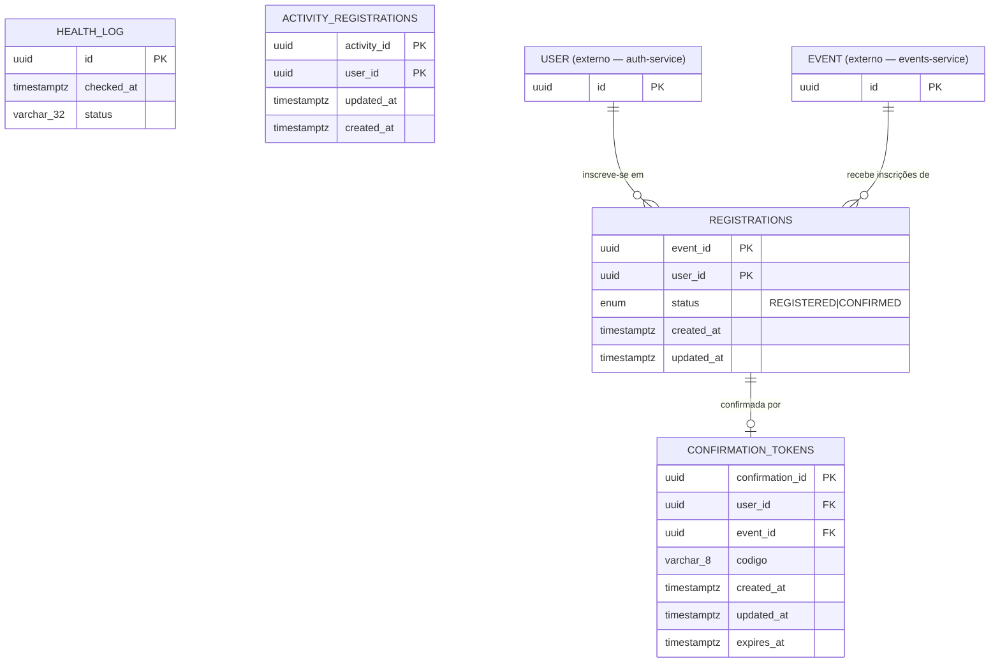

# manifestbolo-t2-registration

Microsserviço responsável por gerenciar inscrições de usuários em eventos da plataforma ManifestoBolo.

---

## Endpoints

| Método | Rota | Descrição |
|--------|------|-----------|
| `GET` | `/health` | Health check da aplicação |
| `GET` | `/events/available` | Lista eventos com vagas disponíveis |
| `GET` | `/events/{event_id}/registrations` | Lista inscritos de um evento |
| `POST` | `/activities/registrations` | Cria uma inscrição em atividade |
| `GET` | `/activities/{activity_id}/users/{user_id}` | Busca uma inscrição de atividade por atividade e usuário |
| `POST` | `/events/{event_id}/guests` | Inscreve um convidado em um evento |
| `GET` | `/events/{event_id}/guests/{user_id}/check-in` | Valida inscrição para check-in (uso interno) |
| `POST` | `/events/confirmation/{confirmation_id}` | Confirma inscrição via código alfanumérico |

> Todos os endpoints de registro retornam `501 Not Implemented` — a estrutura de banco e contratos de API estão definidos, a lógica de negócio ainda não foi implementada.

---

## Modelagem Conceitual

### Entidades

**`Registration`** — entidade central do serviço. Representa a inscrição de um usuário em um evento.

| Atributo | Tipo | Notas |
|---|---|---|
| `event_id` | UUID | PK composta — referência ao evento externo |
| `user_id` | UUID | PK composta — referência ao usuário externo |
| `status` | ENUM(`REGISTERED`, `CONFIRMED`) | Status atual da inscrição |
| `created_at` | TIMESTAMP WITH TZ | Preenchido automaticamente |
| `updated_at` | TIMESTAMP WITH TZ | Nullable — preenchido automaticamente |

**`ConfirmationToken`** — token temporário usado para confirmar a inscrição via código alfanumérico.

| Atributo | Tipo | Notas |
|---|---|---|
| `confirmation_id` | UUID | PK |
| `user_id` | UUID | Referência ao usuário (sem FK — integridade via aplicação) |
| `event_id` | UUID | Referência ao evento (sem FK — integridade via aplicação) |
| `codigo` | VARCHAR(8) | Alfanumérico, 6–8 caracteres, gerado pelo backend |
| `created_at` | TIMESTAMP WITH TZ | Automático |
| `updated_at` | TIMESTAMP WITH TZ | Nullable — preenchido quando a confirmação é realizada |
| `expires_at` | TIMESTAMP WITH TZ | Controla a validade do token |

**`HealthLog`** — log de execução do health check (entidade de infraestrutura).

| Atributo | Tipo | Notas |
|---|---|---|
| `id` | UUID | PK |
| `checked_at` | TIMESTAMP WITH TZ | Automático |
| `status` | VARCHAR(32) | Ex: `"ok"` |

**`ActivityRegistration`** — tabela de atividades por usuário e seção.

| Atributo | Tipo | Notas |
|---|---|---|
| `activity_id` | UUID | PK composta — referência à atividade externa |
| `user_id` | UUID | PK composta — referência ao usuário externo |
| `updated_at` | TIMESTAMP WITH TZ | Atualizado automaticamente |
| `created_at` | TIMESTAMP WITH TZ | Criado automaticamente |

### Entidades Externas

`User` e `Event` são gerenciados por outros microsserviços e consumidos via HTTP. Este serviço não possui tabelas para eles — os contratos estão em `src/domain/auth/schemas.py` e `src/domain/events/schemas.py`.

### Diagrama ERD



### Relacionamentos

```
[auth-service]          [events-service]
     │                        │
  AuthClient             EventsClient
     │                        │
     └────────┬───────────────┘
              │ (injeção de dependência)
              ▼
      RegistrationService
              │
     ┌────────┴────────┐
     ▼                 ▼
Registration ──1:1──► ConfirmationToken
(event_id PK,        (confirmation_id PK,
 user_id PK)          user_id + event_id idx)
```

| Relacionamento | Cardinalidade | Regra |
|---|---|---|
| User → Registration | 1:N | Um usuário pode se inscrever em vários eventos |
| Event → Registration | 1:N | Um evento pode ter vários inscritos |
| (user_id, event_id) → Registration | UNIQUE | Impede inscrição duplicada |
| Registration → ConfirmationToken | 1:1 lógico | Um token por par `(user_id, event_id)`, indexado — sem FK declarada |

### Regras de Integridade

- **Inscrição duplicada**: bloqueada no `RegistrationService` via HTTP 409 antes do INSERT, com fallback em `IntegrityError`.
- **Token expirado**: controlado por `expires_at`; validação ocorre na camada de serviço.
- **Confirmação**: preenche `updated_at` em `ConfirmationToken` e `confirmation_timestamp` em `Registration`.
- **Integridade referencial** com `User` e `Event`: garantida pela aplicação, não por FK no banco.

---

## Arquitetura

Este serviço segue a decisão registrada em [ADR-0001](./app/documentation/adrs/0001-separacao-clients-http-por-microsservico-externo.md): cada microsserviço externo tem um domínio isolado com `client.py` e `schemas.py` dedicados.

```
src/domain/
├── auth/
│   ├── client.py      ← chamadas HTTP ao auth-service
│   └── schemas.py     ← modelos das respostas do auth-service
├── events/
│   ├── client.py      ← chamadas HTTP ao events-service
│   └── schemas.py     ← modelos das respostas do events-service
├── health/
│   ├── controller.py
│   ├── model.py
│   ├── repository.py
│   ├── schemas.py
│   └── service.py
└── registration/
    ├── controller.py
    ├── model.py
    ├── repository.py
    ├── schemas.py
    └── service.py     ← orquestra AuthClient e EventsClient via injeção
```

---

## Lint e Formatação (Ruff)

O projeto usa [Ruff](https://docs.astral.sh/ruff/) para lint e formatação. A configuração está em [`app/pyproject.toml`](./app/pyproject.toml) (regras `E`, `F`, `I`, `N`, `UP`, `B`, `SIM` com `force-sort-within-sections = true` para o isort).

**Antes de qualquer `git push`**, rode os dois comandos a partir da pasta `app/`:

```bash
ruff check . --fix    # aplica lint + ordena imports (regra I001)
ruff format .         # formata o código (aspas, espaços, quebras de linha)
```

Para apenas validar (sem alterar arquivos), como faz o CI:

```bash
ruff check .
ruff format --check .
```

A pipeline do GitHub Actions roda `ruff check app/ --output-format=github` e falha o build se houver qualquer erro — então é mais rápido corrigir localmente antes de pushar.

---

## Infraestrutura e Publicação de Eventos

Este serviço publica eventos de domínio (`RegistrationConfirmed`, `RegistrationCancelled`) em um tópico SNS via o publisher em [`app/src/domain/notifications/`](./app/src/domain/notifications/), e persiste dados em um RDS Postgres provisionado pelo módulo Terraform em [`app/infra/terraform/rds/`](./app/infra/terraform/rds/). Ambos dependem de uma Ministack (LocalStack-compatible) **compartilhada** com o restante da plataforma — não é a mesma instância isolada que outros forks podem rodar localmente. Ver [ADR-0002](./app/documentation/adrs/0002-publicacao-eventos-dominio-sns.md) para o racional das decisões de design do publisher.

### Checklist de PR — validação ponta a ponta da publicação de eventos

Antes de considerar uma alteração no publisher SNS (ou em `confirm`/`cancel_registration`) pronta para merge, além dos testes automatizados (que mockam o SNS via `moto`), confirme manualmente que o consumidor real processa a mensagem:

- [ ] Suba os três serviços simultaneamente: este fork (`manifestbolo-t2-registration`), o serviço de Metrics (`0x_t2`) e a Ministack compartilhada — os três precisam estar no ar ao mesmo tempo; isso não é reproduzível apenas com os testes automatizados deste repositório.
- [ ] Dispare uma confirmação ou cancelamento real via API deste serviço (ex.: `POST /events/confirmation/{confirmation_id}` ou `DELETE /events/{event_id}/guests/{user_id}`).
- [ ] No Metrics (`0x_t2`), chame `GET /admin/dlq/messages` com um token admin e confirme que a mensagem publicada **não aparece** na dead-letter queue.
- [ ] Se a mensagem cair na DLQ, não marque a US/PR como concluída — investigue primeiro se o `resource_ref` (formato `"{event_id}:{user_id}"`, sem UUID único de inscrição — ver ADR-0002) está no formato que o Metrics espera antes de prosseguir.

### Terraform — validação local

O binário do Terraform não faz parte das dependências do projeto (não há gerenciador de versão configurado neste repo). Para validar o módulo `app/infra/terraform/rds/` sem alterar nenhum recurso:

```bash
cd app/infra/terraform/rds
terraform init
terraform validate
terraform fmt -check -diff
```

`terraform plan`/`terraform apply` exigem a Ministack acessível em `ministack_endpoint` (`terraform.tfvars`, copiado a partir de `terraform.tfvars.example`). O default do módulo é `http://host.docker.internal:4566`, pensado para quando o Terraform roda **de dentro de um container** (CI, outro serviço em Docker) que precisa alcançar o host. Se você está rodando `terraform` **diretamente na sua máquina** (fora de qualquer container), `host.docker.internal` não resolve — use `http://localhost:4566` em `terraform.tfvars` nesse caso (validado neste ambiente: a Ministack respondia em `localhost:4566`, e `host.docker.internal:4566` não teve resposta a partir do host).

### ⚠️ Limitação conhecida da Ministack: porta interna vs. porta publicada no host

Ao rodar `terraform apply` neste módulo, a Ministack cria um container Postgres real para simular o RDS. O output `database_url` (e o output `db_port`) que o Terraform devolve reporta a **porta interna do container** (`5432` — a porta que o Postgres escuta *dentro* da rede Docker da Ministack), **não** a porta real publicada no host da sua máquina. Essa é uma limitação da própria API da Ministack ao emular `aws_db_instance`, não algo corrigível neste módulo Terraform — a mesma limitação já havia sido observada e documentada no fork `avengers`.

Isso significa que **não dá para usar `terraform output -raw database_url` diretamente no `.env`** — a conexão vai falhar (ou pior, silenciosamente conectar em outra coisa na mesma porta interna). Depois de rodar `terraform apply`, é necessário descobrir manualmente a porta real:

```bash
# 1. Aplique o módulo normalmente
cd app/infra/terraform/rds
terraform apply -auto-approve

# 2. Encontre o container Postgres que a Ministack criou para este RDS
#    (o nome segue o padrão ministack-rds-<identifier>-db; identifier = "registration-db" em main.tf)
docker ps --format "{{.Names}}\t{{.Image}}\t{{.Ports}}" | grep registration

# 3. Confirme a porta REAL publicada no host
docker port ministack-rds-registration-db
# 5432/tcp -> 0.0.0.0:<porta-real>   <- use essa porta, não a do terraform output

# 4. Monte DATABASE_URL manualmente no .env usando host localhost + a porta real
#    (não host.docker.internal, e não a porta 5432 do terraform output)
DATABASE_URL=postgresql+psycopg2://<user>:<password>@localhost:<porta-real>/app_db

# 5. Rode as migrations contra a porta real
alembic upgrade head
```

Verificado empiricamente neste ambiente: `terraform output` reportou `db_port = 5432`, mas `docker port ministack-rds-registration-db` mostrou a porta real publicada como `15433`. A migration completou com sucesso (`alembic upgrade head`) apontando para `localhost:15433`, criando as 5 tabelas esperadas (`activity_registrations`, `alembic_version`, `authentication_tokens`, `health_log`, `registrations`).
