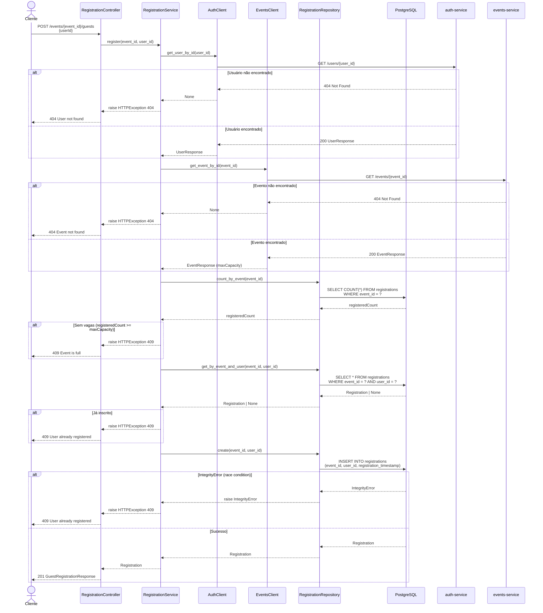
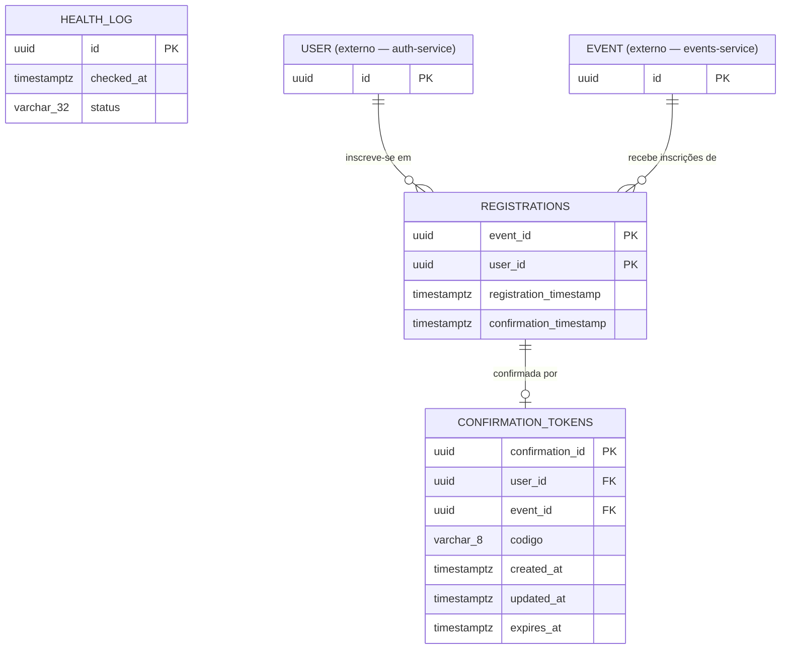

# manifestbolo-t2-registration

Microsserviço responsável por gerenciar inscrições de usuários em eventos da plataforma ManifestoBolo.

---

## Endpoints

| Método | Rota | Descrição |
|--------|------|-----------|
| `GET` | `/health` | Health check da aplicação |
| `GET` | `/events/available` | Lista eventos com vagas disponíveis |
| `GET` | `/events/{event_id}/registrations` | Lista inscritos de um evento |
| `POST` | `/events/{event_id}/guests` | Inscreve um convidado em um evento |
| `DELETE` | `/events/{event_id}/guests/{user_id}` | Cancela a inscrição de um convidado |
| `GET` | `/events/{event_id}/guests/{user_id}/check-in` | Valida inscrição para check-in (uso interno) |
| `POST` | `/events/confirmation/{confirmation_id}` | Confirma inscrição via código alfanumérico |

> Todos os endpoints de registro retornam `501 Not Implemented` — a estrutura de banco e contratos de API estão definidos, a lógica de negócio ainda não foi implementada.

---

## Modelagem Conceitual

### Entidades

**`Registration`** — entidade central do serviço. Representa a inscrição de um usuário em um evento.

| Atributo | Tipo | Notas |
|---|---|---|
| `event_id` | UUID | PK composta — referência ao evento externo |
| `user_id` | UUID | PK composta — referência ao usuário externo |
| `registration_timestamp` | TIMESTAMP WITH TZ | Preenchido automaticamente |
| `confirmation_timestamp` | TIMESTAMP WITH TZ | Nullable — preenchido ao confirmar |

**`ConfirmationToken`** — token temporário usado para confirmar a inscrição via código alfanumérico.

| Atributo | Tipo | Notas |
|---|---|---|
| `confirmation_id` | UUID | PK |
| `user_id` | UUID | Referência ao usuário (sem FK — integridade via aplicação) |
| `event_id` | UUID | Referência ao evento (sem FK — integridade via aplicação) |
| `codigo` | VARCHAR(8) | Alfanumérico, 6–8 caracteres, gerado pelo backend |
| `created_at` | TIMESTAMP WITH TZ | Automático |
| `updated_at` | TIMESTAMP WITH TZ | Nullable — preenchido quando a confirmação é realizada |
| `expires_at` | TIMESTAMP WITH TZ | Controla a validade do token |

**`HealthLog`** — log de execução do health check (entidade de infraestrutura).

| Atributo | Tipo | Notas |
|---|---|---|
| `id` | UUID | PK |
| `checked_at` | TIMESTAMP WITH TZ | Automático |
| `status` | VARCHAR(32) | Ex: `"ok"` |

### Entidades Externas

`User` e `Event` são gerenciados por outros microsserviços e consumidos via HTTP. Este serviço não possui tabelas para eles — os contratos estão em `src/domain/auth/schemas.py` e `src/domain/events/schemas.py`.

### Diagrama de Sequência — Inscrição de Convidado



### Diagrama ERD



### Relacionamentos

```
[auth-service]          [events-service]
     │                        │
  AuthClient             EventsClient
     │                        │
     └────────┬───────────────┘
              │ (injeção de dependência)
              ▼
      RegistrationService
              │
     ┌────────┴────────┐
     ▼                 ▼
Registration ──1:1──► ConfirmationToken
(event_id PK,        (confirmation_id PK,
 user_id PK)          user_id + event_id idx)
```

| Relacionamento | Cardinalidade | Regra |
|---|---|---|
| User → Registration | 1:N | Um usuário pode se inscrever em vários eventos |
| Event → Registration | 1:N | Um evento pode ter vários inscritos |
| (user_id, event_id) → Registration | UNIQUE | Impede inscrição duplicada |
| Registration → ConfirmationToken | 1:1 lógico | Um token por par `(user_id, event_id)`, indexado — sem FK declarada |

### Regras de Integridade

- **Inscrição duplicada**: bloqueada no `RegistrationService` via HTTP 409 antes do INSERT, com fallback em `IntegrityError`.
- **Cancelamento**: DELETE físico — não há `cancelled_at` ou campo `status` em `Registration`.
- **Token expirado**: controlado por `expires_at`; validação ocorre na camada de serviço.
- **Confirmação**: preenche `updated_at` em `ConfirmationToken` e `confirmation_timestamp` em `Registration`.
- **Integridade referencial** com `User` e `Event`: garantida pela aplicação, não por FK no banco.

---

## Arquitetura

Este serviço segue a decisão registrada em [ADR-0001](./app/documentation/adrs/0001-separacao-clients-http-por-microsservico-externo.md): cada microsserviço externo tem um domínio isolado com `client.py` e `schemas.py` dedicados.

```
src/domain/
├── auth/
│   ├── client.py      ← chamadas HTTP ao auth-service
│   └── schemas.py     ← modelos das respostas do auth-service
├── events/
│   ├── client.py      ← chamadas HTTP ao events-service
│   └── schemas.py     ← modelos das respostas do events-service
├── health/
│   ├── controller.py
│   ├── model.py
│   ├── repository.py
│   ├── schemas.py
│   └── service.py
└── registration/
    ├── controller.py
    ├── model.py
    ├── repository.py
    ├── schemas.py
    └── service.py     ← orquestra AuthClient e EventsClient via injeção
```
